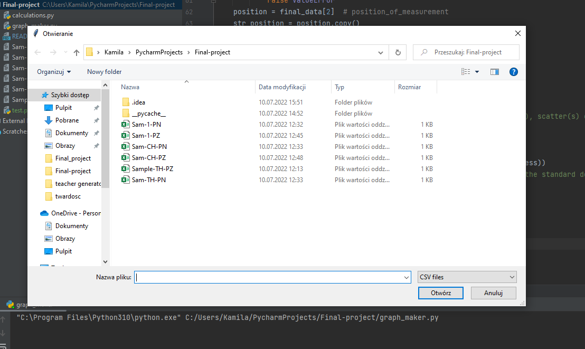
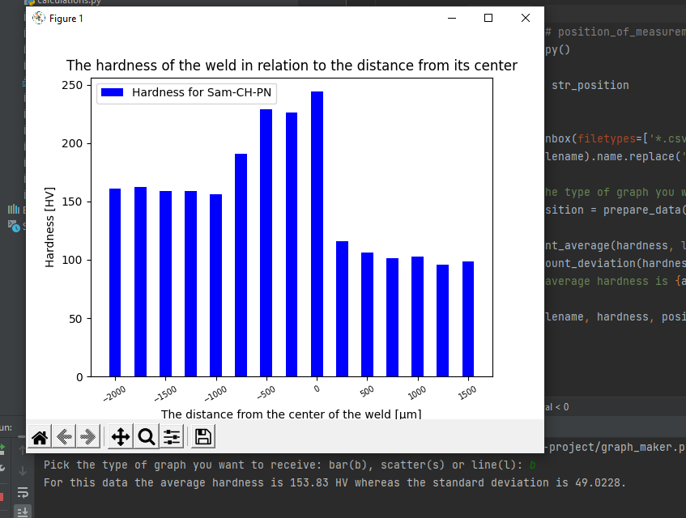

#GRAPH MAKER

**Table of Contents
  General Info
  
  Technologies Used
  
  Screenshots
  
  Project Status
  
  Contact
  

General Information

The idea to create this project was to speed up making of repetitive graphs. During my Engineer Thesis I have spent definitely too much time on changing different parameters in Excel. That is why I have decided to write a code that allows user to prepare plots in less than half a minute.
Currently (July/2022), working in the steel structure industry, I can also use this code to run various projects.

Technologies Used

  Python 3.10.2
  
  NumPy 1.23.0
  
  matplotlib.pyplot 3.5.2
  
  easygui 0.98.3
  
  pathlib
  

Screenshots

First program asks us to choose file with data. Files with the csv extension are intentionally set. 

Based on user data 'Graph Maker' prepares a plot for user and counts average and standard deviation.

Project Status

Project is: complete.
However, my next goal is to enable the use of databases and making graphs based on them.

Contact
Created by @milakow - feel free to contact me!

Many thanks to CODE:ME Foundation for truly amazing Python course. 
Last eight weeks were extremely busy, but I am determined to work on my code even more.
